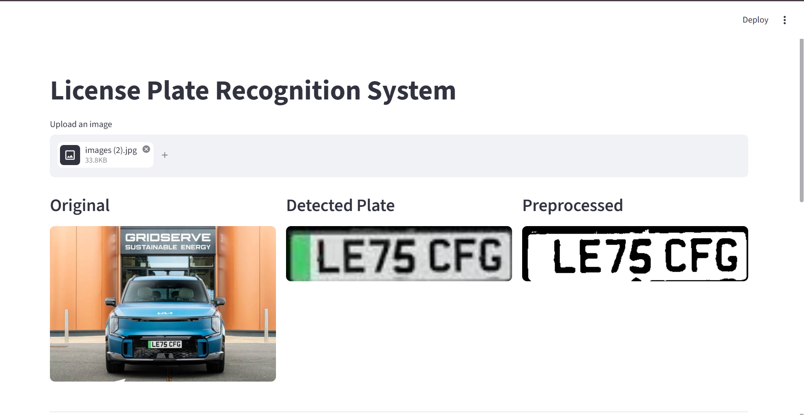
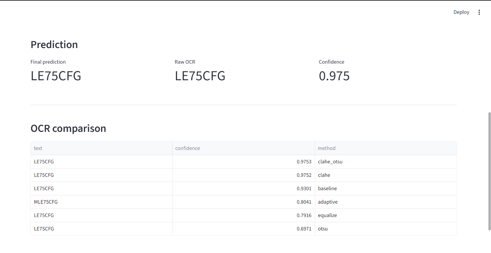

# License Plate Recognition System

A Deep Learning project for automatic license plate detection and recognition.

The system detects license plates using a YOLO11 object detector and recognizes the extracted text using EasyOCR. Several image preprocessing techniques, Super Resolution, and OCR post-processing are applied to improve recognition quality.





## Features

- License plate detection with YOLO11
- Plate extraction
- Multiple preprocessing techniques
    - Baseline
    - Histogram Equalization
    - CLAHE
    - Otsu Thresholding
    - Adaptive Thresholding
- Super Resolution (FSRCNN)
- OCR using EasyOCR
- OCR post-processing
- Streamlit web interface
- Evaluation notebooks

---

## Pipeline

```
Input image
      ↓
YOLO11 detection
      ↓
License plate extraction
      ↓
Image preprocessing
      ↓
Super Resolution
      ↓
EasyOCR
      ↓
OCR post-processing
      ↓
Final prediction
```

---

## Technologies

- Python
- PyTorch
- Ultralytics YOLO11
- OpenCV
- EasyOCR
- Streamlit
- Pandas
- Matplotlib

---

## Running the Streamlit application

```bash
streamlit run web.py
```

---

## Results

The project includes:

- Exploratory Data Analysis (EDA)
- YOLO11 model training
- OCR preprocessing comparison
- OCR pipeline
- Pipeline evaluation
- Interactive Streamlit demonstration

---

## Limitations

The OCR module is based on EasyOCR, a general-purpose optical character recognition model. Recognition quality depends on image resolution, illumination, viewing angle, and plate quality. Additional improvements could be achieved by training a license-plate-specific OCR model.
